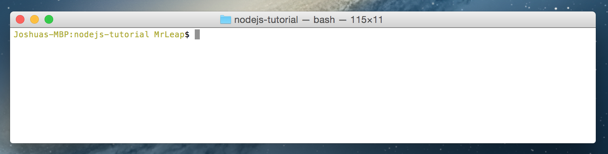

<!-- START doctoc generated TOC please keep comment here to allow auto update -->
<!-- DON'T EDIT THIS SECTION, INSTEAD RE-RUN doctoc TO UPDATE -->
**Table of Contents**  *generated with [DocToc](https://github.com/thlorenz/doctoc)*

- [Getting started with Node.js](#getting-started-with-nodejs)
  - [What is Node.js?](#what-is-nodejs)
    - [Editors](#editors)
  - [Installation](#installation)
    - [Windows](#windows)
    - [OSX](#osx)
    - [Linux](#linux)
  - [Terminal](#terminal)
  - [Testing the Installation](#testing-the-installation)
  - [The REPL](#the-repl)
  - [NPM](#npm)
  - [Hello World](#hello-world)

<!-- END doctoc generated TOC please keep comment here to allow auto update -->

# Getting started with Node.js

## [What is Node.js?](what-is-node-js)
It was 2009. Ryan Dahl, feeling the tools of the day for writing servers was terrible, set out to fix it. He took the open source JavaScript engine that Google Chrome uses, added an event loop and a low level I/O API and dubbed it Node.js.

Node.js is an "asynchronous event driven JavaScript runtime". In practice, it's great for quickly spinning up all sorts of things that run on the internet. Web servers, game servers, micro services. Almost anything that works over UDP, TCP, HTTP could benefit from Node.js.

### [Editors](editors)
I personally use [Sublime Text](https://www.sublimetext.com/) because of how well it handles large files. There are tons of high quality free options out there that offer all sorts of fancy things. All the guides in this series will recommend (but not require) syntax highlighting.

That said, here's a few more high quality free editors that I've used and like. You'll benefit from using any one of them:

- [Atom](https://atom.io/)
- [Visual Studio Code](https://code.visualstudio.com/)
- [Notepad++](https://notepad-plus-plus.org/) (Windows Only)

## [Installation](installation)

### Windows
Go to the [Node.js webpage](https://nodejs.org/en/) and download the current version installer for your system.

Then simply run the installer and follow the prompts.

*As you get deeper into the node ecosystem you'll discover that a default windows installation is missing a lot of development tools OSX and Linux environments take for granted. Especially when installing packages from NPM. Two that come to mind immediately are [python](https://www.python.org/downloads/) and [git](https://git-scm.com/). If you're intent to embark on the harrowing journey that is Node.js development on windows, read your error messages and respond to them. A line that says `gyp ERR! stack Error: Can't find someThing executable "someThing"` means you need to go out and download yourself some someThing.*

### OSX
Get the current OSX installer from the [Node.js webpage](https://nodejs.org/en/) and run it.

Alternatively if you'd like, you can [install homebrew](http://brew.sh), a package manager, and install node with `brew install node` in your terminal.

### Linux
The process for this is going to vary wildly depending on your distribution. [Click here for an exhaustive guide on installing from a package manager](https://nodejs.org/en/download/package-manager/).

## [Terminal](terminal)

Working with node is going to require a lot of command line usage.

Windows users can access command prompt with `windows key + R`, typing `cmd` and hitting enter. Alternatively, you can type `cmd` in the start menu search.


OSX users can press `command + space` and type `terminal`. Or go to `finder > applications > utilities > terminal`.



Linux users can perform whatever magic spell is required for their particular distribution.

It's important you know how to navigate around your file system using the terminal. Windows/OSX/Linux users can change their current directory with the `cd` command. You can make new folders with `mkdir`. A common way to start a new project is `cd <you project directory>` `mkdir <name of your new project without spaces>` `cd <name of the folder you just made>`.


## [Testing the Installation](testing-the-installation)

In your terminal, try the command `node -v`.  If it says v7.5.0, or similar, the installation was successful. The `-v` there is called a command line argument. `-v` is an argument that tells node to return the version.


## [The REPL](the-repl)

REPL stands for Read-Evaluate-Print Loop. It's a sandbox that lets you write and immediately execute javascript line by line.

Once installed, you can run the `node` command from your terminal without any arguments to open up the REPL. Your command prompt should look like this now.

```
>
```

Type `1+1` in the box and hit enter. It should say `2` on the next line. Yay we did math.

You can get out of the REPL by pressing `control + C` twice. `control + C` is the hotkey to politely ask terminal processes to die. Alternatively you can exit by typing `.exit`.


## [NPM](npm)

NPM is node's package manager. It's the major way that node users share their work with each other. Let's try it.

First let's install a package with this command. The `-g` makes it install globally. That way we'll never want for cat names no matter the project.

`npm install -g cat-names` (some might need sudo in front).

Now let's open up the repl and run this code

`require('cat-names').random()`

I got Mimi!

## [Hello World](hello-world)

The REPL is a great tool but most scripts live in files. Make a file named hello.js in your favorite editor. Type or copy this code:

Save it in a new project folder.
```javascript
//Load the cat-names module and puts it in a variable
var catNames = require('cat-names');
//i is zero. While i is less than 10 do everything between the {}
for(var i = 0; i < 10; i = i + 1){
	console.log("Hello " + catNames.random());
}
//and then add 1 to i and go back to the top {
```
The comments make an attempt to explain what each line does. We'll get in to it more on the next lesson, so don't fret if you don't exactly know what's going on there.

Open up your terminal, Navigate to your project folder with `cd`. Run the command `node hello.js`. You'll get something like this:

```
Hello Smokey
Hello Kitty
Hello Cali
Hello Midnight
Hello Bob
Hello Casper
Hello Samantha
Hello Misty
Hello Gracie
Hello Harley
```

Now we're cooking with gas and can make our first MUD.

